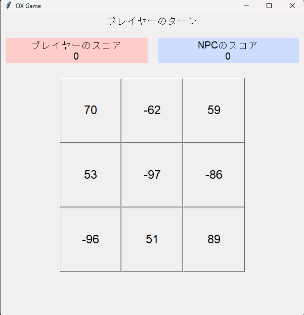
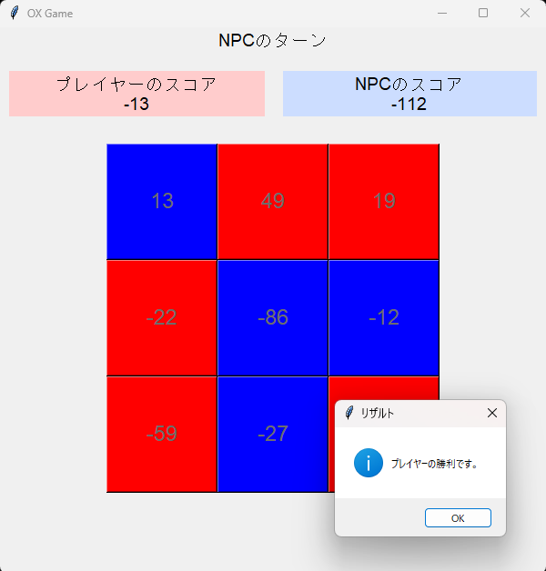
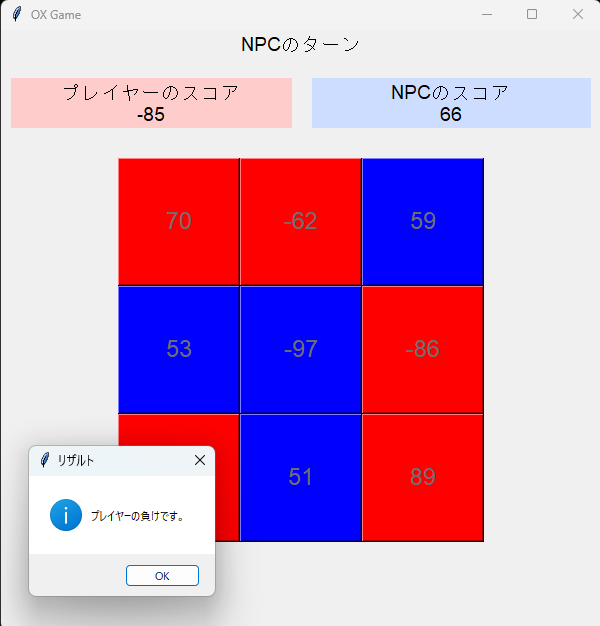

# OX Game

OX Gameは、シンプルなGUIを持つ三目並べゲームです。このゲームはPythonのtkinterライブラリを使用して構築されています。
[こちら](https://atcoder.jp/contests/abc349/tasks/abc349_e)を原案に、NPCと対戦できるものを制作しました。

## ゲームの説明

OX Gameは、プレイヤーとNPCが交互にボード上のセルを選択し、スコアを競うゲームです。各セルにはランダムな値が割り当てられており、プレイヤーとNPCがセルを選択することでスコアが増加します。最終的に、スコアが高い方が勝者となります。NPCが最適解を選んで勝利できる盤面においては最適な動きをします。

## ゲームのスクリーンショット





## ゲームのルール

1. ゲームボードは3x3のグリッドです。
2. 各セルにはランダムな値（-100から100）が割り当てられます。
3. プレイヤーとNPCは交互にセルを選択します。
4. 選択したセルの値はプレイヤーまたはNPCのスコアに加算されます。
5. 同じ列、行、または対角線上に同じ色が並んだ場合、その色の持ち主が勝利します。
6. すべてのセルが選択された場合、スコアが高い方が勝者となります。

## インストール方法

1. このリポジトリをクローンします:
    ```sh
    git clone https://github.com/yourusername/ox-game.git
    ```
2. 必要なライブラリをインストールします（必要に応じて）:
    ```sh
    pip install tk
    ```

## 実行方法

1. ターミナルまたはコマンドプロンプトでプロジェクトディレクトリに移動します。
2. 以下のコマンドを実行してゲームを開始します:
    ```sh
    python main.py
    ```

## コード構成

- `main.py`: ゲームのメインロジックとGUIを含むPythonスクリプト。

## 使用方法

1. ゲームを開始すると、プレイヤーまたはNPCのどちらかが先行します。
2. プレイヤーのターンの場合、任意のセルをクリックして選択します。
3. NPCのターンは自動的に進行します。
4. ゲームの終了条件が満たされると、勝者が表示され、再試行または終了のオプションが提供されます。
